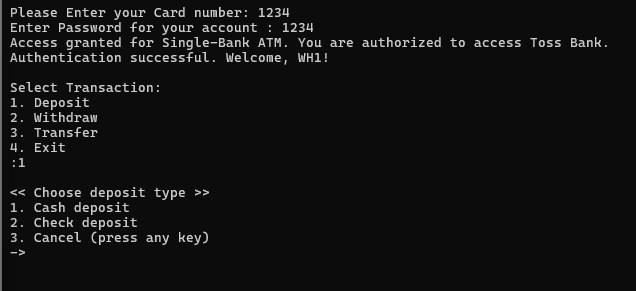
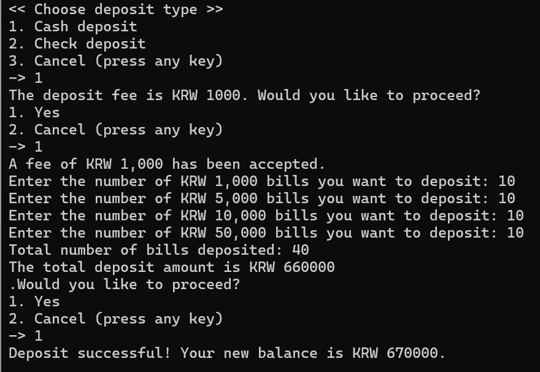
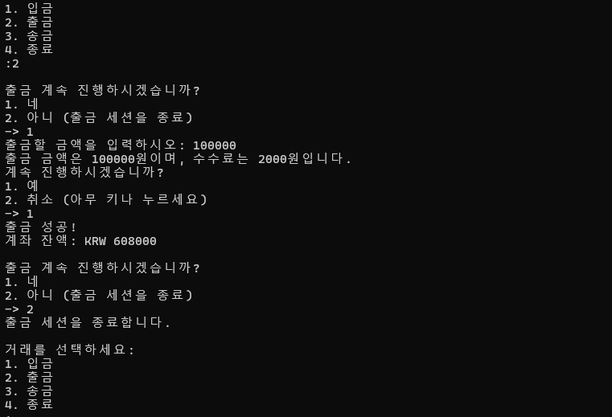

# OOP Term Project Report: Automated Teller Machine (ATM) System Development 

(HotPeppers_Bank; 뜨거운 고추들 은행)

Authors: **Woohyuk Kwon, Daeyang Seo, Wonjung Baek, Junho Kim**  
Submission Date: 2024년 11월 27일   

---

## Introduction

This report documents the implementation of an ATM system as per the requirements specified in the project instructions. The system was developed using Object-Oriented Programming (OOP) principles in C++ and consists of ATM, Bank, and Account classes. This document explains how each requirement was implemented with supporting command-line screenshots.

---

# Table of Contents

1. [Introduction](#introduction)  
2. [Requirement Implementation](#requirement-implementation)  
   - [REQ 1: System Setup](#req-1-system-setup)  
     - [REQ 1.1](#req1.1) (An ATM has a 6-digit serial number that can be uniquely identified among all ATMs)  
     - [REQ 1.2](#req1.2) (An ATM is set to one of the following types: (1) Single Bank ATM, (2) Multi-Bank ATM)  
     - [REQ 1.3](#req1.3) (An ATM may support either unilingual or bilingual languages)  
     - [REQ 1.4](#req1.4) (A Bank deposits a certain amount of cashes to an ATM to serve users)  
     - [REQ 1.5](#req1.5) (A Bank can open an Account for a user with the necessary information to perform bank services)  
     - [REQ 1.6](#req1.6) (A user may have multiple Accounts in a Bank)  
     - [REQ 1.7](#req1.7) (A user may have Accounts in multiple Banks)  
     - [REQ 1.8](#req1.8) (Each ATM has several types of transaction fees)  
     - [REQ 1.9](#req1.9) (An admin can access the menu of “Transaction History” via an admin card)  
     - [REQ 1.10](#req1.10) (An ATM only accepts and returns the following types of cashes and checks)  
     - [REQ 1.11](#req1.11) (All accounts and ATMs shall be created and initialized during the program execution)  
   - [REQ 2: ATM Session](#req-2-atm-session)  
     - [REQ 2.1](#req2.1) (A session starts when a user inserts a card)  
     - [REQ 2.2](#req2.2) (A session ends whenever a user wishes)  
     - [REQ 2.3](#req2.3) (When a session ends, the summary of all transactions performed in a session must be displayed)  
     - [REQ 2.4](#req2.4) (Each transaction has a unique identifier across all sessions)  
   - [REQ 3: User Authorization](#req-3-user-authorization)  
     - [REQ 3.1](#req3.1) (An ATM checks if the inserted card is valid for the current type of ATM)  
     - [REQ 3.2](#req3.2) (If an invalid card is inserted, the ATM shall display an appropriate error message)  
     - [REQ 3.3](#req3.3) (An ATM shall ask a user to enter the password and verify if the password is correct)  
     - [REQ 3.4](#req3.4) (If the entered password is incorrect, the ATM shall display an appropriate error message)  
     - [REQ 3.5](#req3.5) (If a user enters wrong passwords 3 times in a row, a session is aborted, and the card is returned)  
   - [REQ 4: Deposit](#req-4-deposit)  
   - [REQ 5: Withdrawal](#req-5-withdrawal)  
   - [REQ 6: Transfer](#req-6-transfer)  
   - [REQ 7: Transaction History](#req-7-transaction-history)  
   - [REQ 8: Multi-language Support](#req-8-multi-language-support)  
   - [REQ 9: Exception Handling](#req-9--exception-handling)  
   - [REQ 10: Display of Account/ATM Snapshot](#req-10---display-of-accountatm-snapshot)  
3. [Conclusion](#conclusion)

---

## Requirement Implementation

### REQ 1: System Setup

#### (REQ1.1) An ATM has a 6-digit serial number that can be uniquely identified among all ATMs (e.g., 315785).   
   
   
ATM을 개설할 때마다 사용자로부터 Serial Number를 입력받도록 구현되었다. 또한, 각 ATM은 고유한 6자리 Serial Number를 가져야 하므로, Serial Number가 중복되면 다시 입력을 요청해야하고고 입력된 Serial Number가 6자리가 아니면 올바른 형식으로 입력하라는 메시지를 출력하고 재입력을 요구해야 한다. 위 사진은 ATM1의 Serial Number를 123123으로 설정한 경우, ATM2의 Serial Number는 123123으로 설정할 수 없도록 중복이 방지되는 것을 확인할 수 있다다. 또한, Serial Number가 3자리수와 같이 올바르지 않은 경우 ATM 설정이 거부되고 재입력을 요구하는 것을 확인할 수 있다.

#### (REQ1.2) An ATM is set to one of the following types: (1) Single Bank ATM, (2) Multi-Bank ATM.   
   
ATM기를 개설하는 과정에서 Single인지, Multi인지 사용자가 선택할 수 있도록 구현하였다.   
     
#### (REQ1.3) An ATM may support either unilingual or bilingual languages.   
   - When an ATM is configured unilingual, all information is displayed in English only.   
   - When an ATM is configured bilingual, a user can choose if the information is to be displayed either English or Korean (Note: if you know only one of the languages, consider using a language translation service, such as Google Translation).  
   
   
ATM을 설정하는 과정에서 unilingual or bilingual인지 선택할 수 있다. 사용자가 Uni를 입력했을 경우, 영어로만 출력하고 Bi를 입력할 경우, session 이후에 아래 사진과 같이 영어를 또는 한국어를 선택할 수 있다.

#### (REQ1.4) A Bank deposits a certain amount of cashes to an ATM to serve users.   
   
ATM의 초기설정에서 각 ATM의 1,000원, 5,000원, 10,000원, 50,000원 지폐 수를 설정할 수 있다. 

#### (REQ1.5) A Bank can open an Account for a user with the necessary information to perform bank services.   
   - (e.g.) Bank name (e.g, Kakao, Shinhan), User name, Account number (12-digit), Available funds, Transaction histories.   

  
#### (REQ1.6) A user may have multiple Accounts in a Bank.  

위 사진은 dy1 유저가 toss 은행 계좌를 1개 만드는 것을 보여준다.  
     
#### (REQ1.7) A user may have Accounts in multiple Banks.

Kukyang 유저가 Kakao와 Toss 은행의 계좌를 개설하는 사진이다. 

#### (REQ1.8) Each ATM have several types of transaction fees, and paid as follows: 
- Deposit fee for non-primary banks: KRW 2,000; the fee is paid by inserting additional cash.
- Deposit fee for primary banks: KRW 1,000; the fee is paid by inserting additional cash. 
- Deposit fee for non-primary banks: KRW 2,000; the fee is paid by inserting additional cash.
- Deposit fee for primary banks: KRW 1,000; the fee is paid by inserting additional cash. 
- Withdrawal fee for a primary bank: KRW 1,000; the fee is paid from the withdrawal account.
- Withdrawal fee for non-primary banks: KRW 2,000; the fee is paid from the withdrawal account.
- Account transfer fee between primary banks: KRW 2,000; the fee is paid from the source account.
- Account transfer fee between primary and non-primary banks: KRW 3,000; the fee is paid from the source account. 
- Account transfer fee between non-primary banks: KRW 4,000; the fee is paid from the source account.
- Cash transfer fee to any bank type: KRW 1,000; the fee is paid by inserting additional cash. 
 
* Account 개설 상태  

|  | `Account 1` | `Account 2` | `Account 3` |
| :---- | :---- | :---- | :---- |
| `Bank` | `Toss` | `Toss` | `Kakao` |
| `USER` | `JH1` | `JH2` | `JH3` |
| `Card number` | `1234` | `1235` | `1236` |
| `Account number` | `123123123123` | `123123123125` | `123123123126` |

계좌 개설을 위 표와 같이 한 상태이다.
	
 * ATM 생성 상태

|  | `ATM 1` | `ATM 2` |
| :---- | :---- | :---- |
| `Type` | `Single` | `Multi` |
| `Primary Bank` | `Toss` | `Kakao` |

ATM 생성을 위 표와 같이 한 상태이다.

* **Deposit**

ATM 1(Toss, single) - Account 1 (Toss) 

위 사진을 통해, Single로 설정한 Toss 뱅크에 Toss 카드를 삽입하여 입금을 시도할 경우, 1,000원의 수수료가 부과되는 것을 확인할 수 있다.

ATM2(Kakao, Multi) - Account2(Toss)

위 사진을 통해, Multi로 설정한 Kakao 뱅크에 Toss 카드를 삽입하여 입금을 시도할 경우, 2,000원의 수수료가 부과되는 것을 확인할 수 있다.

* **Withdraw**

ATM1(Toss, single) - Account1 (Toss)

	위 사진을 통해, Single로 설정한 Toss 뱅크에 Toss 카드를 삽입하여 출금을 시도할  경우, 1,000원의 수수료가 부과되는 것을 확인할 수 있다.    

ATM2(Kakao, Multi) - Account2(Toss)

	아래 사진을 통해, Single로 설정한 Toss 뱅크에 Toss 카드를 삽입하여 출금을 시도할  경우, 2,000원의 수수료가 부과되는 것을 확인할 수 있다.

* **Transfer**

ATM1(Toss, Single) 보내는 계좌: Account1 (Toss) -> 받는 계좌: Account2(Toss)

ATM1(Toss, Single) 보내는 계좌: Account1 (Toss) -> 받는 계좌: Account3(Kakao)

ATM2(Kakao, Multi) 보내는 계좌: Account1 (Toss) -> 받는 계좌: Account2(Toss)

#### (REQ1.9) An admin can access the menu of “Transaction History” via an admin card (See REQ Display of Transaction History).

#### (REQ1.10) An ATM only accepts and returns the following types of cashes and checks.  

- (Cash type) KRW 1,000, KRW 5,000, KRW 10,000, KRW 50,000
- ◼ When implementing the ATM, you need to take each denomination of bills into account. In other words, instead of representing the ATM’s remaining cash as a single number, it should be implemented in a way that allows you to know how many bills of each denomination are left.   
     

위 사진과 같이 ATM 화면에는 남아 있는 현금의 잔여 개수가 표시되며, 각 지폐별로 잔량이 나타납니다. 예를 들어, 1,000원권, 5,000원권, 10,000원권, 그리고 50,000원권의 지폐 개수가 각각 얼마 남아 있는지가 명확하게 확인 가능하다.  
      
      
      
- ◼ Therefore, all actions of inserting cash to the ATM are performed by specifying the number of bills for each denomination.
   
- (Check type) Any amount over KRW 100,000 check (e.g., KRW 100,000, 100,001, 234,567 are all valid checks)
    
<현금>
    
  

<수표>  
    

      
#### (REQ1.11) All accounts and ATMs shall be created and initialized during the program execution.  
- During the program execution, the necessary information to create accounts and ATMs shall be given from a user via console input (i.e., hard coding of account and ATM information is not allowed).  
- The accounts and ATMs shall be created and initialized based on the user input.
- In other words, at the program's start, there must be a function that creates an ATM instance and a BANK instance. The initial state of the program may also include functions for selecting an ATM.
    
  

Account 와 ATM은 compile 이후 사용자가 cmd에서 값을 입력해서 생성한다.   
    

---

### REQ 2: ATM Session

#### (REQ2.1) A session starts when a user inserts a card. 
- A session begins when a user inserts a card (card number input).
  

ATM 선택 후, 유저가 카드를 입력하면서 session이 시작된다. 

#### (REQ2.2) A session ends whenever a user wishes (e.g., by choosing a cancel button) or there are some exceptional conditions detected by the ATM (e.g., no cash available).

   

#### (REQ2.3) When a session ends, the summary of all transactions performed in a session must be displayed. 

- (e.g.) Account/card info, transaction types (deposit, transfer, withdrawal), and their amount, …

- If no transactions are successfully completed during the session, it is acceptable not to print a summary.
  

   

#### (REQ2.4) Each transaction has a unique identifier across all sessions.
     

Transaction 마다 ID가 있다. 

---

### REQ 3: User Authorization

#### (REQ3.1) An ATM checks if the inserted card is valid for the current type of ATM. 
     
- The ATM requests and validates the user's password via communication with the Bank class.

Account number가 111122223333이고, card number가 1234인 account를 생성한 뒤, ATM creation 이후 session을 시작할때 user authentication 과정을 진행한다. 먼저 ATM의 언어지원에 따라 영어/한국어를 선택하고, 직후에 authentication 과정이 이루어진다. card number를 입력했을때, 해당 카드가 valid한지 확인하는 과정을 거쳐서 최종적으로 인증에 성공하게 된다. 입력을 1234가 아닌 123을 입력했을때는, 해당 account가 존재하지 않아 invalid하다는 출력을 띄워 valid 한 card number가 들어올 수 있게 했다.

#### (REQ3.2) If an invalid card is inserted, the ATM shall display an appropriate error message (e.g., Invalid Card). 

ATM1은 현재 Toss bank의 Single 타입ATM 이므로, 여기에 invalid한 Woori bank의 계좌를 통해 접근을 시도했을때 접근이 불가능해야한다. 스크린샷에서는 그 구현이 잘 이루어졌고, 추가적으로 해당 ATM이 Toss Bank와 관련되어있다고 설명해주고 있다.   
또한 invalid한 카드 말고도, 아예 존재하지 않는 카드일 경우에는 다른 error message를 띄워준다. 밑 스크린샷에서, 아예 존재하지 않는 1234567 카드가 입력되면, “There’s no account available~” 에러 메세지가 출력된다.

     
#### (REQ3.3) An ATM shall ask a user to enter the password (e.g., Enter Password), and verify if the password is correct. 

ATM에서 입력한 비밀번호를 받아 authenticateUser 함수를 통해 인증하는 과정이다. 비밀번호가 올바르면 인증 성공 메시지를 출력하고, 계좌와 연결된 은행을 식별합니다. 인증 실패 시 적절한 메시지를 출력하며, 재입력을 요청한다.
     
#### (REQ3.4) If the entered password is incorrect, the ATM shall display an appropriate error message (e.g., Wrong Password). 

카드번호 ‘1234’에 맞는 적절한 password는’1234’일때, ‘1294786’이라는 틀린 password가 들어오면 “Incorrect password~” error message를 띄우고, 해당 session내에서 남은 시도횟수를 보여준다.
     
#### (REQ3.5) If a user enters wrong passwords 3 times in a row, a session is aborted, and return the card to the user. 

해당 card number에 맞는 비밀번호는 ‘1234’ 일때, 1294786, 1245, 1 이렇게 3번 잘못된 비밀번호를 입력했을때,  session이 종료되고 카드가 유저에게 돌아가도록 작동한다.

---

### REQ 4: Deposit

#### (REQ4.1) An ATM shall take either cash or check from a user. - The number of bills is entered separately for each denomination 
     
- Users can deposit cash or checks into the ATM, adhering to the limit of 50 bills or 30 checks per transaction.
  

deposit 종류를 Cash deposit과 Check deposit으로 나눠서 구현하였다. Cash deposit을 선택하면 현금을 사용한 deposit 과정이 진행되고, Check deposit을 선택하면 수표를 사용한 deposit 과정이 시작된다.

   

#### (REQ4.2) An ATM shall display an appropriate error message if the number of the inserted cash or checks exceed the limit allowed by the ATM. 

Cash deposit에서, 현금을 넣는 개수가 50개가 넘어갈때 갯수 초과로 인한 에러 메세지가 출력되고 있다. 현금 개수를 적절하게 분배하더라도, 총합 개수가 50이 넘어가면 에러 메세지가 출력된다.

#### (REQ4.3) Once cash or checks are accepted by ATM, the transaction must be reflected to the bank account as well (i.e., the same amount of fund must be added to the corresponding bank account). 
     
-3.1. Cash deposit
- ◼ 3.1.1. primary bank
   

  
primary bank 이므로 fee는 1000원 이다. 수수료 입금에 동의하면서 1000원을 낸 것이다. 원래 10,000원이 들어있었고, 수수료를 제외한 66,000원이 입금되면서 76,000원이 된다.

- ◼ 3.1.2. not primary bank

Multi ATM에서  primary bank 가 아니므로 fee는 2000원이다. 수수료 입금에 동의하면서 2000원을 낸 것이다. 원래 76,000원이 들어있었고, 수수료를 제외한 66,000원이 입금되면서 142,000원이 된다.

-3.2. Check deposit`  
- ◼ 3.2.1. Primary bank
  

primary 이므로 수수료는 1000원이다. 수수료에 동의하면서 수수료를 지불한다. 원래 142000원이었는데 10만원 짜리 수표 2장을 입금하면서 342,000원이 된다.
     
- ◼ 3.2.2. Non Primary Bank  

non primary 이므로 수수료는 2000원. 수수료에 동의하면서 수수료를 지불한다. 원래 342000원이었는데 10만원 짜리 수표 2장을 입금하면서 542,000원이 된다.

#### (REQ4.4) Some deposit fee may be charged (See REQ in System Setup) 
- In case of a check deposit, a fee must be served as cash.
- The deposit amount and the fee must be entered separately, with one entry for the deposit and another for the fee. 
     
- Primary bank
  

primary 이므로 수수료는 1000원. 수수료에 동의하면서 수수료를 지불한다(The deposit amount and the fee must be entered separately).   
     
- Non Primary Bank  

non primary 이므로 수수료는 2000원. 수수료에 동의하면서 수수료를 지불한다(The deposit amount and the fee must be entered separately). 

#### (REQ4.5) The deposited cash increase available cash in ATM that can be used by other users. 

ATM(serial num: 123123)에 cash deposit기능으로 , primary bank 계좌에 각 현금을 10장씩 입금하는 상황 (primary 수수료 1000원). 원래 ATM에 모든 현금이 10장씩 있던 상황에서, 각 현금이 다시 10장씩 입금되면서 총 20장이 된다. 여기서 천원권 이 21장인 이유는 수수료 1000원을 받았기 때문에 한장이 더 많다.

#### (REQ4.6) The deposited check does not increase available cash in ATM that can be used by other users.  

ATM(serial num: 123123)에 check deposit기능으로 , primary bank 계좌에 10만원 수표 한장을 입금한 상황 (primary 수수료 1000원). 수수료 천원 지불로 인해 1000원 권의 장수가 21장에서 22장이 되었고, 다른 현금의 개수는 동일하다. 

---

### REQ 5: Withdrawal

#### (REQ5.1) An ATM shall ask a user to enter the amount of fund to withdraw. 
- The user does not manually input the number of each denomination. Instead, the user only enters the desired withdrawal amount, and the ATM will dispense the cash using the fewest number of possible bills (which means using the highest denomination bills as much as possible)
  
- For example, when user withdrawals KRW 17,000, the ATM dispenses:
◼ 1 bill of KRW 10,000
◼ 1 bill of KRW 5,000
◼ 2 bills of KRW 1,000
  
 

770,000 원이 있던 계좌에서 10000원을 출금했다. 수수료 1000원은 계좌에서 인출되면서 770,000-10,000-1,000 = 759,000 원이 남는다. ATM에서는 만원권 한장이 줄어서 19장이 됐다.

여기서 추가적으로 16000원을 출금해보자

- 

759,000원이었던 계좌에서 수수료 천원과 16000원이 출금되어 742,000원이 되었다. 16,000원은 만원 한장, 5천원 한장, 그리고 천원 한장이므로 각 한장씩 ATM 잔여 현금이 줄어 들었다.  
     
     
#### (REQ5.2) An ATM shall display an appropriate error message if there is insufficient fund in the account or insufficient cash in the ATM. 

 

ATM에 5만원권 0장, 만원권 18장, 5천원권 19장, 천원권 22장인 상황에서 50만원 인출을 하려고 하면, ATM에 현금이 부족하다는 에러가 뜬다.
     
#### (REQ5.3) Once the withdrawal is successful, the transaction must be reflected to the bank account as well (i.e., the same amount of fund must be deducted from the corresponding bank account).   

759,000원이었던 계좌에서 수수료 천원과 16000원이 출금되어 742,000원이 되었다.

#### (REQ5.4) Some withdrawal fee may be charged (See REQ in System Setup). 

(1) Withdrawal fee for a primary bank: KRW 1,000

Primary Bank(Atm과 카드 모두 toss인 상황) 에서 fee 1000원이 청구된다.

(2) Withdrawal fee for non-primary banks: KRW 2,000;

Non-primary bank (atm은 kakao, 카드는 toss) 일 때 fee 2000원이 청구된다.
     
#### (REQ5.5) The cash withdrawal lowers available cash in the ATM that can be used by other users.  

16,000원은 만원 한장, 5천원 한장, 그리고 천원 한장이므로 각 한장씩 ATM 잔여 현금이 줄어 들었다.
     
#### (REQ5.6) The maximum number of withdrawals per each session is 3.  
- If a user wants to withdraw four times, it needs to end the current session after withdrawing three times and restart another session for one more withdrawal.  
     
3번 인출 후 추가 인출을 같은 session에서 시도할 경우 경고 메시지와 함께 withdraw가 진행되지 않는다.
     
#### (REQ5.7) The maximum amount of cash withdrawal per transaction is KRW 500,000.   
 
1,000,000원 인출을 시도했다. 최대 500,000원 인출이 가능하다는 경고메시지와 함께 인출이 진행되지 않는다.

---

### REQ 6: Transfer

#### (REQ6.1) An ATM shall ask a user to choose the transfer types either cash transfer or account fund transfer.  
     
session 시작 후 Transfer를 선택하면, Cash Transfer나 Account transfer 중에 어떤 거래를 시작할건지 물어보게 한다.  
     
#### (REQ6.2) For both cash and account transfers, an ATM shall ask the destination account number where the fund is to be transferred.

- 2.1 Cash transfer  
 
Cash transfer에서 ATM이 destination bank를 먼저 물어보고, 해당 bank가 존재하는지 확인한 뒤에 destination account number를 입력받는다.
     
- 2.2 Account transfer
   
Account transfer에서도 마찬가지로 destination bank를 물어보고, 해당 destination bank의 account number를 입력받는다.   
     
     
     
#### (REQ6.3) For cash transfer, an ATM shall ask the user to insert the cash and transaction fees. After all the cash has been inserted, the ATM shall verify the amount to be transferred, excluding the  transaction fee. All inserted cash, minus the transaction fee, shall be transferred.  

Cash transfer에서, 먼저 primary/non-primary bank 에 따른 수수료를     체크해서, 사용자에게 먼저 이 수수료를 지불할건지 물어본다. 이후 Confirm을 눌러서 수수료를 지불하고, 넣을 현금의 개수를 입력하게된다. 넣은 현금의 개수를 총합한 값을 다시 사용자에게 알려주며 한 번 더 verify 과정을 거치고,

#### (REQ6.4) For account transfer, an ATM shall ask the source account number, and the amount of fund to be transferred. (If it is assumed that the source account has already been accessed at the start of the session using a card or other means, there is no need to ask again.) 

     
#### (REQ6.5) Some transfer fee may be charged (See REQ in System Setup).   

5.0 Initial Bank/Account/ATM Setting
     
5.1 Transfer between primary banks(Fee : 2000)

ATM1(Toss Single ATM)에 Toss’1234’계정으로 로그인하여, destination bank를 Toss ‘2345’ 계정으로 설정해두면 primary 계정 사이에서의 거래이므로 fee가 2000원으로 정상적으로 요구하는 것을 볼 수 있다.  
     
5.2 Transfer between primary and non-primary banks(Fee : 3000)

ATM2(Woori Multi ATM)에 Toss ‘1234’ 계정으로 로그인하여, destination bank를 Woori ‘3456’ 계정으로 두면, non-primary 와 primary bank 사이의 거래이므로 올바르게 3000원의 fee를 요구하게된다.
   

5.3 Transfer between non-primary banks(Fee : 4000)

ATM2를 사용해서 거래를 진행할거고, ATM2는 현재 Woori bank - Multi bank이다. 이때 세션 로그인을 Toss bank 계정 ‘1234’ 으로 했고, destination bank를 마찬가지로 non-priamry bank 계정인 ‘2345’계정으로 송금한다. 둘 다 non-primary bank이므로, 이때 fee는 4000원으로 올바르게 뜬다는 것을 확인할 수 있다.

#### (REQ6.6) The inserted cash for transfer increase available cash in ATM that can be used by other users. 
   
     
     
#### (REQ6.7) Once the transfer is successful, the transaction must be reflected to the bank account as well (i.e., the same amount of fund must be deducted from the source bank account, and then added to the destination bank account).  
 

### REQ 7: Transaction History

#### (REQ7.1) When a session is started by an admin by inserting an admin card (See REQ in System Setup), an ATM displays a menu of “Transaction History” only. 

0000을 입력하면 (admin code) Admin mode로 들어간다. Transaction history를 묻고, 여기서 yes라고 하면 History를 조회할 수 있다.
     
#### (REQ7.2) When the “Transaction History” menu is selected, an ATM displays the information of all transactions from all users since the system started.
- Transaction ID, Card Number, Transaction Types, Amount, other transaction-specific information 
- Each transaction may have different types of information, so they need to be appropriately displayed (e.g., a deposit transaction does not have the source account information in a transfer transaction).
  

Transaction ID가 부여된다. 각 기능 별로 필요한 정보 (Source account, Destination account 등) 가 뜬다.
     
     
#### (REQ7.3) The “Transaction History” information shall be outputted to the external file (e.g., txt file). 
     
The transaction history is saved to a text file (transaction_history.txt).

---

#### REQ 8: Multi-language Support

#### (REQ8.1) An ATM that is configured with the bilingual support shall provide an option for a user to choose the preferred language either English or Korean.  

 

여기에서 ATM2가 Bi-language ATM으로 세팅된 상태이고, 세션을 시작하고 거래에 사용할 ATM을 ATM2로 골랐을때, 언어 선택창이 먼저 띄워지고, 1번을 선택하면 이후의 문자자가 모두 영어로 출력되는 반면 2번을 선택하면 한국어로 모든 문자가 출력되고있다. 

#### (REQ8.2) Once a certain language is chosen, all menus must be displayed using the chosen language. 

  

 

언어를 한국어로 선택하고, session을 시작해서 여러가지 Transaction을 진행해보았다.`

---

### REQ 9:  Exception Handling

#### (REQ9.1) The ATM shall display an appropriate error message for each exception scenario (both explicitly stated in this document and implicitly assumed ones), then end the session. 

1. 없는 ATM을 사용하겠다고 입력할시 (ex. ATM은 2대인데 3번째 ATM을 쓴다고 입력)

Invalid ATM index 라는 말과 함께 다시 session을 시작하는 지점으로 돌아간다.

2. 없는 카드번호 입력시

3. Session에서 없는 Transaction 번호 호출시

4. 돈의 수량을 음수(negative)로 입력했을 때 

5. Session을 입력하는데 잘못된 문자를 입력할 때

---

### REQ 10:   Display of Account/ATM Snapshot

#### (REQ10.1) When the character ' / ' (slash) is given as a console input during the program execution, the following information shall be displayed to the console. - All ATMs’ information: Remaining cash 
     
◼ (e.g., ATM [SN: 111111] remaining cash: {KRW 50000 : 0, KRW 10000 : 1, KRW 5000 : 2, KRW 1000 : 1}, ATM [SN: 222222] remaining cash: {KRW 50000 : 5, KRW 10000 : 3, KRW 5000 : 1, KRW 1000 : 2}) - All accounts’ information: Remaining balance   
     
◼ (e.g., Account [Bank: Kakao, No: 111111111111, Owner: Jenny] balance: 7000, Account [Bank: Daegu, No: 222222222222, Owner: Tom] balance: 1000, Account [Bank: Shinhan, No: 333333333333, Owner: Jenny] balance: 2000)

1. session 입력란에서 “/” 를 입력하면 모든 ATM에 대한 Snapshot이 뜬다.

2. Transaction 선택란에서 “/” 를 입력해도 모든 ATM에 대한 Snapshot이 뜬다.

---

## 3. Conclusion

This report summarizes the development and implementation of an Automated Teller Machine (ATM) system using Object-Oriented Programming (OOP) principles in C++. The system fulfills the specified requirements by integrating various functionalities such as ATM setup, user authorization, deposit, withdrawal, fund transfer, transaction history management, and multi-language support. Exception handling and session management have also been implemented to ensure robust and user-friendly operations. Key functionalities are demonstrated with screenshots and logs, highlighting compliance with project requirements. The system's design prioritizes accuracy, user experience, and extensibility, ensuring it meets the demands of real-world ATM operations.

Attachments:

- Source code (atm.cpp)  
- Sample output screenshots  
- transaction_history.txt
